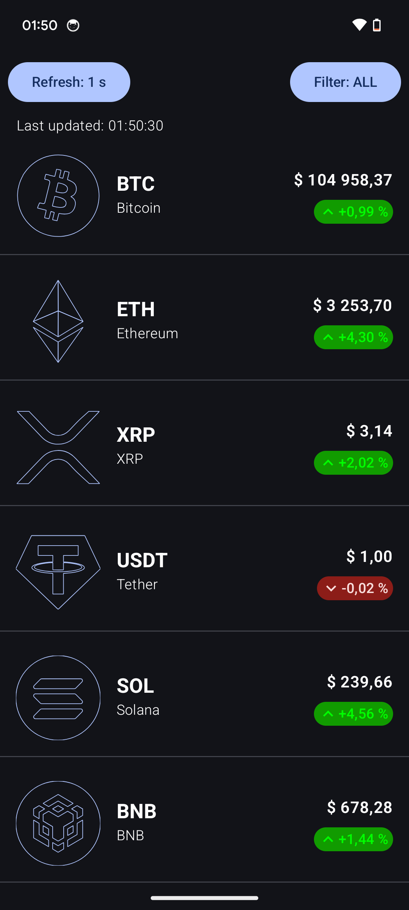

# MarketWebSocket (Тестове завдання)

**MarketWebSocket** – це Android-додаток, розроблений на **Kotlin**, для **моніторингу котирувань біржових активів у реальному часі** з використанням **WebSocket**. Проєкт створений у рамках тестового завдання, ілюструє роботу з **Coroutines**, **MVI-патерном** та **Clean Architecture**, а також виводить **сповіщення** про різкі зміни цін.

---
## Скріншоти

## **Функціональність**

1. **Реальний час**  
   - Додаток під’єднується до WebSocket-сервера та отримує дані про ціни активів **у реальному часі**.  
   - Список автоматично оновлюється при надходженні нових даних.

2. **Список активів і пошук**  
   - На **головному екрані** відображається список активів із **поточними цінами**.  
   - Видно **час останнього оновлення**, можна налаштувати **частоту** (1, 2 або 5 секунд).

3. **Деталі активу**  
   - При виборі активу відкривається **детальний екран**.

4. **Фільтрація даних**  
   - Можна **налаштувати фільтри** (наприклад, показувати тільки улюблені активи, TOP_GAINERS, TOP_LOSERS тощо).  
   - **Обрані активи** зберігаються у `SharedPreferences` (WATCHLIST).

5. **Сповіщення про різкі коливання цін**  
   - Якщо ціна улюбленого активу змінилася більш ніж на **5%** протягом **1 хвилини**, додаток надсилає **локальне сповіщення**.

6. **Foreground Service**  
   - Додаток має **Foreground Service**, що виконується у фоні та періодично перевіряє зміни цін.

7. **Адаптивний інтерфейс для великого екрану / горизонтальної орієнтації**  
   - Використання **`NavigableListDetailPaneScaffold`** (із `accompanist-adaptive`) робить застосунок зручнішим у горизонтальному положенні, дає змогу відображати **список** і **деталі** одночасно.

---

## **Архітектура та ключові технології**

1. **MVI (Model-View-Intent) патерн**  
   - **ViewModel** керує станом (`CoinListState`, `CoinListAction`, `CoinListEvent`).  
   - **View** підписується на **StateFlow** та відображає зміни.

2. **Clean Architecture**  
   - **Data** – містить реалізації `CoinDataSource`, роботу з WebSocket, `FavoritesRepository`.  
   - **Domain** – інтерфейси та бізнес-логіка (відбір монет, обробка ціни).  
   - **Presentation** – `ViewModel`, Composable-екрани, події.  
   - **Core** – сервіс, загальні утиліти, DI (Koin або інша залежність).

3. **Kotlin Coroutines**  
   - **Flow** – для обробки стрімів із WebSocket.  
   - **StateFlow** – для стану у ViewModel.  
   - **Launchers** – для асинхронного оновлення UI.

4. **WebSocket**  
   - Використовується **API [coincap.io](https://coincap.io/)**.  
   - **Вебсокет повертає лише оновлені монети** (не весь список), тому для **розширеного списку** реалізовано запит REST, який потім **оновлюється** даними з WebSocket.  
   - **coincap.io відслідковує історію лише по днях**, тож для побудови **динамічного графіка** використовується **дані, що приходять онлайн**, і зберігаються та відображаються безпосередньо у додатку.  
   - **Графік зроблено нативно через Canvas** (без сторонніх бібліотек).

5. **SharedPreferences**  
   - Використовується для зберігання **улюблених монет**.

6. **Notifications**  
   - **Foreground Notification** для сервісу.  
   - **Price Change Alerts** при значній зміні ціни (>5%).

---

## **Можливості для подальшого розвитку**

1. **DataStore або Room**  
   - Замість `SharedPreferences` можна використати **Jetpack DataStore** або **Room** для більш складних даних.

2. **Реактивна фільтрація**  
   - Зараз фільтри застосовуються у ViewModel, але можна винести логіку у **UseCase** та зробити ще **динамічніший** підхід (наприклад, при великій кількості монет).

3. **Кешування історії**  
   - Зберігати **історію цін** у локальній базі, щоб навіть без інтернету можна було переглянути динаміку за попередні періоди.

4. **Кастомні нотифікації**  
   - Додаткові налаштування: порогові значення (не тільки 5%), різні режими сповіщень.

5. **Розширений UI**  
   - Підтримка планшетів чи **responsive-дизайн**, використання **Compose Navigation** для детальнішої архітектури.

6. **Більше тестів**  
   - Збільшити покриття **Unit-тестами** та **Integration-тестами**.  
   - Адаптувати Koin-модулі для **test flavor** (моки, фейкові сервери).
